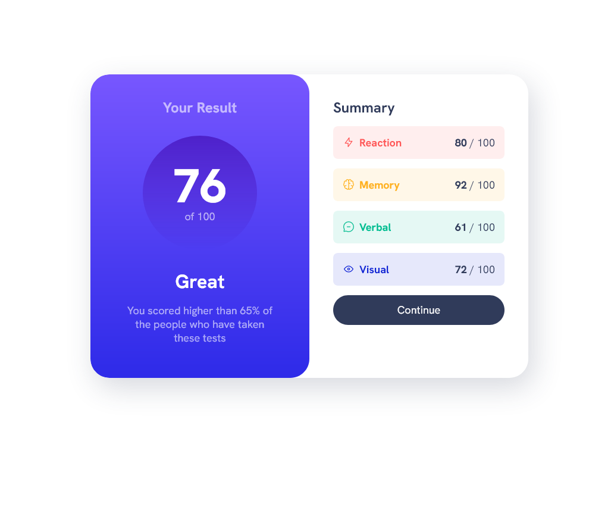

# Frontend Mentor - Advice generator app solution

This is a solution to the [Advice generator app challenge on Frontend Mentor](https://www.frontendmentor.io/challenges/advice-generator-app-QdUG-13db). Frontend Mentor challenges help you improve your coding skills by building realistic projects.

## Table of contents

- [The challenge](#the-challenge)
- [Screenshot](#screenshot)
- [Links](#links)
- [Built with](#built-with)
- [Author](#author)

### The challenge

Users should be able to:

- See hover states for interactive elements

### Screenshot

### Links

- Solution URL: [Github repo](https://github.com/Andy-Esm/fm-results-summary-component)
- Live Site URL: [Github pages](https://andy-esm.github.io/fm-results-summary-component/)

### Built with

- Semantic HTML5 markup
- CSS custom properties
- Flexbox
- CSS Grid
- JavaScript

### Author

- Github - [Andrey Esman](https://github.com/Andy-Esm)
- Frontend Mentor - [@Andy-Esm](https://www.frontendmentor.io/profile/Andy-Esm)
